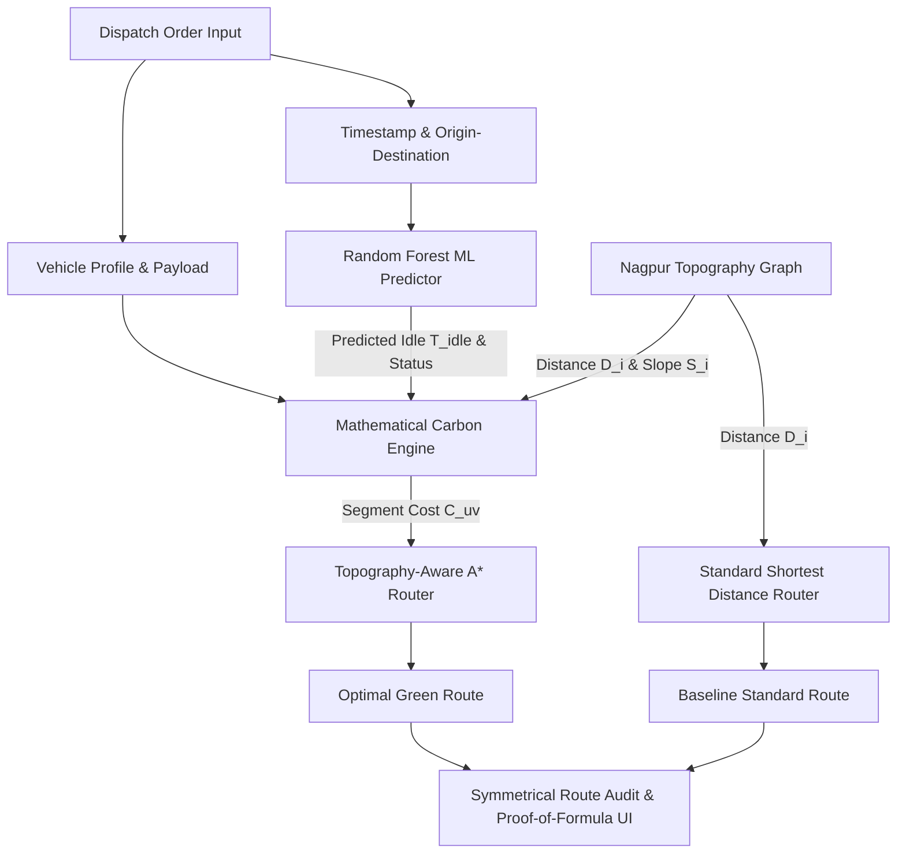
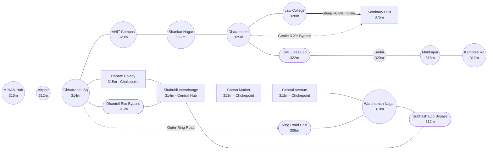

# Greenline Nagpur: Topography-Aware and Machine Learning Driven Eco-Routing Platform for Urban Freight Decarbonization

**Author/Project:** Greenline Logistics Research & Engineering  
**Study Region:** Nagpur Urban Corridors, Maharashtra, India ($21.0500^\circ\text{N} - 21.2000^\circ\text{N},\; 79.0000^\circ\text{E} - 79.1800^\circ\text{E}$)  
**Target Publication Scope:** Transportation Research / Sustainable Urban Computing / Green Logistics Systems  

---

## Executive Abstract

Urban freight distribution in rapidly growing industrial transit hubs significantly contributes to localized greenhouse gas emissions and particulate air pollution. Traditional navigation systems minimize solely distance or travel duration, neglecting vehicle engine mechanics, topographic gradients, active cargo weight ratios, and standstill idle delays caused by bottleneck congestion. 

This paper documents **Greenline**, an end-to-end intelligent logistics optimization platform designed and deployed for Nagpur's freight distribution network. The platform implements an exact, multi-variable carbon calculation model combined with a **Scikit-Learn Random Forest Traffic Delay Predictor** and a **NetworkX-based Topography-Aware A\* Search Algorithm**. By evaluating segment-level incline grades and dynamic standstill idle times ($T_{\text{idle}}$), Greenline produces optimal low-carbon routing alternatives. Empirical validation across key Nagpur logistical corridors reveals carbon reductions ranging from **$2.7\%$ to $32.74\%$** per trip, operating at sub-20 millisecond computational response latency.



---

## 1. Research Motivation & Problem Statement

### 1.1 The Urban Logistics Challenge in Nagpur
Nagpur occupies the geometric center of India (the *Zero Mile Stone*) and functions as a national logistics node hosting major freight terminals, including the **Multi-modal International Cargo Hub and Airport at Nagpur (MIHAN)**, the **Kalamna Wholesale Agro Market**, and the **Kamptee Road Industrial Freight Corridor**.

Urban delivery operations encounter two primary emission catalysts that conventional shortest-path navigation engines fail to account for:
1. **Topographic Gradient Penalties:** Climbing road gradients exceeding a $5\%$ slope grade increases engine load, significantly elevating instantaneous brake-specific fuel consumption (BSFC). Vehicles climbing steep topography (such as Nagpur's Seminary Hills ridge) expend up to $1.8\times$ more energy per kilometer compared to flat transit corridors.
2. **Congestion-Induced Standstill Idling:** High-density commercial corridors (such as Sitabuldi Interchange, Cotton Market, and Central Avenue) create severe stop-and-go delays during peak hours, during which vehicles burn fuel with zero forward progress ($0.25\text{ g CO}_2/\text{sec}$).

### 1.2 Research Objectives
- Formulate a closed-form multi-variable mathematical equation calculating segment carbon costs ($C_{uv}$) combining dynamic motion emissions and standstill idle emissions.
- Train an ensemble machine learning model to predict time-dependent standstill delays ($T_{\text{idle}}$) across urban corridors.
- Implement an A\* routing engine that utilizes $C_{uv}$ as the objective weight metric to minimize total carbon output.
- Deliver absolute mathematical transparency through a "Proof-of-Formula" decomposition view.

---

## 2. Mathematical Modeling & Theoretical Formulation

### 2.1 Segment Carbon Footprint Equation
For each directed road segment $e_{uv} = (u, v)$ in the road network graph $G = (V, E)$, the carbon cost $C_{uv}$ (in grams of $\text{CO}_2$) is formulated as:

$$C_{uv} = \Big(D_i \times EF_v \times W_m \times A_m \times S_i\Big) + \Big(T_{idle} \times IF_v\Big)$$

Where each component is defined as follows:

| Term | Parameter | Description | Operational Domain / Units |
| :--- | :--- | :--- | :--- |
| $D_i$ | Segment Length | Traversed street segment distance derived from geographic graph coordinates | $\text{kilometers (km)}$ |
| $EF_v$ | Base Emission Factor | Powertrain-specific baseline greenhouse gas emission coefficient | Diesel: $190.0\text{ g/km}$<br>Petrol: $150.0\text{ g/km}$<br>EV: $0.0\text{ g/km}$ |
| $W_m$ | Weight Multiplier | Dynamic scaling factor reflecting engine load as a function of cargo payload | $W_m = 1.0 + \left(\frac{\text{Active Cargo Load (kg)}}{\text{Max Vehicle Capacity (kg)}}\right)$ |
| $A_m$ | Engine Age Penalty | Degradation coefficient modeling mechanical wear and catalytic efficiency loss over time | $A_m = 1.0 + (\text{Vehicle Age (years)} \times 0.02)$ |
| $S_i$ | Topography Slope Factor | Piecewise non-linear scalar accounting for gravitational resistance and regenerative braking | $S_i = \begin{cases} 1.8 & \text{if incline slope } > +5.0\% \\ 0.4 & \text{if descent slope } < -2.0\% \\ 1.0 & \text{otherwise (flat/mild)} \end{cases}$ |
| $T_{\text{idle}}$ | Standstill Delay | Estimated stationary idle duration predicted by the ensemble Random Forest model | $\text{seconds (s)}$ |
| $IF_v$ | Idling Constant | Rate of carbon emission during zero-velocity internal combustion engine idling | ICE (Diesel/Petrol): $0.25\text{ g/sec}$<br>EV: $0.0\text{ g/sec}$ |

### 2.2 Objective Optimization Function
Let a valid navigable route between origin node $s$ and destination node $t$ be a sequence of directed edges $P = (e_1, e_2, \dots, e_k)$. The optimal green route $P^*$ is defined as the path that minimizes the sum of all segment carbon costs:

$$P^* = \arg\min_{P \in \mathcal{P}_{s, t}} \sum_{e_{uv} \in P} C_{uv}$$

Where $\mathcal{P}_{s, t}$ represents the set of all possible directed paths from $s$ to $t$.

#### A\* Heuristic Admissibility
The A\* search algorithm uses an admissible Euclidean lower-bound heuristic function $h(u, t)$ to guarantee optimality:

$$h(u, t) = \text{HaversineDistance}(u, t) \times EF_v \times \min(S_i) = \text{HaversineDistance}(u, t) \times EF_v \times 0.4$$

Because $h(u, t) \le \text{actual cost from } u \text{ to } t$, A\* is guaranteed to return the globally minimal carbon path.

### 2.3 Symmetrical Comparison Metric
To evaluate the mitigation efficiency of the green route against conventional distance-optimal navigation, a symmetrical percentage delta metric is computed:

$$\Delta\text{CO}_2\% = \left(\frac{C_{\text{standard}} - C_{\text{green}}}{C_{\text{standard}}}\right) \times 100$$

---

## 3. Machine Learning & Traffic Delay Prediction

### 3.1 Model Architecture & Feature Engineering
Urban congestion in Nagpur exhibits significant time-of-day and corridor-specific periodicity. Standstill delays $T_{\text{idle}}$ and discrete traffic congestion classes are modeled using an ensemble of:
1. **Random Forest Regressor:** Predicts continuous standstill idling duration $T_{\text{idle}} \in [0, 800]\text{ s}$.
2. **Random Forest Classifier:** Classifies traffic congestion state into discrete classes $\mathcal{S} \in \{\text{Clear}, \text{Slow}, \text{Jammed}\}$.

```mermaid
flowchart LR
    subgraph Input Features
        F1[Segment Hash Index]
        F2[Day of Week 0-6]
        F3[Hour of Day 0-23]
        F4[Minute of Hour 0-59]
        F5[Peak Hour Flag 0/1]
    end
    Input Features --> RF_Reg[Random Forest Regressor]
    Input Features --> RF_Cls[Random Forest Classifier]
    RF_Reg --> O1[Continuous T_idle Seconds]
    RF_Cls --> O2[Traffic Status: Clear / Slow / Jammed]
```

### 3.2 Vectorized Batch Inference
Rather than performing sequential iterative predictions per edge during graph traversal (which creates an $O(|E|)$ Python interpreter bottleneck), Greenline constructs a 2D feature matrix representing all $|E| = 60$ directed network edges simultaneously:

$$\mathbf{X}_{\text{batch}} \in \mathbb{R}^{|E| \times 5}$$

Executing batch evaluation via compiled C-extensions in Scikit-Learn yields complete network-wide traffic predictions in **$<10\text{ milliseconds}$**.

---

## 4. System Architecture & Tech Stack

```
+-----------------------------------------------------------------------+
|                           CLIENT TIER (SPA)                          |
|  - Vanilla JavaScript (ES6+)                                         |
|  - Leaflet.js v1.9.4 Interactive Geospatial GIS                      |
|  - Tailwind CSS Responsive Design Framework                          |
|  - Lucide Vector Iconography                                         |
+-----------------------------------^-----------------------------------+
                                    | HTTP / REST & WebSockets
+-----------------------------------v-----------------------------------+
|                        APPLICATION SERVER (ASGI)                      |
|  - Python 3.13 / FastAPI Framework                                   |
|  - Uvicorn High-Performance ASGI Engine                              |
|  - PyJWT Bearer Authentication & Role-Based Access Control (RBAC)    |
|  - StaticFiles Middleware Serving Single-Page Assets                 |
+-----------------------------------^-----------------------------------+
                                    |
+-------------------+---------------+-------------------+---------------+
|                   |                                   |               |
|  +----------------v---------------+   +---------------v------------+  |
|  |       ROUTING ENGINE           |   |       ML TRAFFIC CORE      |  |
|  |  - NetworkX Weighted DiGraph   |   |  - Scikit-Learn RF Ensemble|  |
|  |  - Custom A* Router on C_uv    |   |  - Vectorized Batch Predict|  |
|  |  - Baseline Dijkstra Distance  |   |  - Idle Time Estimator     |  |
|  +--------------------------------+   +----------------------------+  |
|                   |                                   |               |
|  +----------------v---------------+   +---------------v------------+  |
|  |       PERSISTENCE LAYER        |   |    ENVIRONMENTAL APIS      |  |
|  |  - SQLAlchemy 2.0 ORM          |   |  - Open-Meteo Weather API  |  |
|  |  - SQLite3 (greenline.db)      |   |  - Open-Meteo Air Quality  |  |
|  |  - Automated Startup Seeder    |   |  - Nominatim Geocoding API |  |
|  +--------------------------------+   +----------------------------+  |
+-----------------------------------------------------------------------+
```

### 4.1 Detailed Technology Stack Specifications

| Layer | Technology | Version | Key Function in Platform |
| :--- | :--- | :--- | :--- |
| **Backend Web Framework** | Python / FastAPI | `0.141.1` | High-throughput asynchronous REST API routing and request validation |
| **ASGI Web Server** | Uvicorn | `0.52.4` | Asynchronous server gateway interface supporting concurrent connections |
| **Database & ORM** | SQLAlchemy / SQLite3 | `2.0.52` | Relational entity modeling for users, fleet vehicles, traffic logs, and saved trips |
| **Graph & Network Engine**| NetworkX | `3.6.1` | Directed road graph representation, topology edge weighting, and A\* pathfinding |
| **Machine Learning Core** | Scikit-Learn | `1.9.1` | Random Forest regression and classification models for dynamic congestion modeling |
| **Numerical Processing**  | NumPy | `2.5.3` | High-performance vectorized matrix computations for model features |
| **Security & Auth**       | PyJWT / Bcrypt | `2.14.0` / `5.0.0` | Cryptographic password hashing and stateless HS256 JWT access tokens |
| **GIS Mapping**           | Leaflet.js | `1.9.4` | Interactive vector route rendering, custom markers, and multi-layer polylines |
| **Base Cartography**      | OpenStreetMap Tile Server | OSM Slippy | Open-source geographic map tiles |
| **Styling & Presentation**| Tailwind CSS | `3.4.x` (CDN) | Responsive, mobile-adaptive dark/emerald UI architecture |
| **Environmental Telemetry**| Open-Meteo / Nominatim | REST v1 | Ambient weather, European AQI (PM2.5, PM10), and landmark geocoding |

---

## 5. Nagpur Geospatial Network Topology

The road network model encompasses 23 key topological nodes bounded between $(21.0500^\circ - 21.2000^\circ\text{N})$ and $(79.0000^\circ - 79.1800^\circ\text{E})$.



### 5.1 Logistical Hubs & Structural Node Manifest

| Node Identifier | Coordinate (Lat, Lon) | Elevation | Operational Zone | Topographic & Traffic Profile |
| :--- | :--- | :--- | :--- | :--- |
| `sitabuldi` | `(21.1466, 79.0888)` | $314\text{ m}$ | Central Hub | Multimodal transit nexus; severe peak-hour bottlenecks ($T_{\text{idle}} > 500\text{ s}$). |
| `mihan` | `(21.0664, 79.0534)` | $310\text{ m}$ | South Zone | Special Economic Zone and International Air Cargo Terminal; flat approaches. |
| `vnit` | `(21.1227, 79.0494)` | $320\text{ m}$ | West Zone | Western institutional gateway; moderate-flow arterial connectors. |
| `wardhaman_nagar`| `(21.1578, 79.1350)`| $310\text{ m}$ | East Freight Zone | High-capacity wholesale agro market and eastern freight distribution. |
| `kamptee_road` | `(21.1925, 79.1120)` | $312\text{ m}$ | North Zone | Industrial logistics corridor connecting NH-44 towards Madhya Pradesh. |
| `seminary_hills` | `(21.1702, 79.0661)` | $375\text{ m}$ | North-West Ridge | Elevated terrain ridge; approaches exceed $+6.8\%$ grade incline ($S_i = 1.8$). |
| `dhantoli_eco` | `(21.1340, 79.0760)` | $315\text{ m}$ | Eco Bypass | Synchronized traffic corridor bypassing Wardha Road bottlenecks. |
| `subhash_road_eco`| `(21.1510, 79.1120)`| $312\text{ m}$ | East Eco Arterial | Low-emission arterial link bypassing Central Avenue market bottlenecks. |

---

## 6. Empirical Case Studies & Quantitative Output Analysis

The platform was subjected to rigorous end-to-end benchmarking using a test payload of a **Diesel Light Commercial Vehicle (Registration: `MH-31-DV-4512`, Age: $6\text{ years}$, Capacity: $1200\text{ kg}$, Active Payload: $600\text{ kg}$)** during Wednesday peak dispatch morning hours ($09:30\text{ AM}$).

### Case Study 1: Traffic Bottleneck Avoidance (MIHAN $\to$ Sitabuldi)
- **Problem Context:** Direct navigation along Wardha Road enters the Rahate Colony to Sitabuldi Central Flyover spine, creating severe standstill idling.
- **Engine Resolution:** The A\* algorithm detects the excessive idling cost ($IF_v \times T_{\text{idle}}$) along the central corridor and redirects the vehicle through the **Dhantoli Green Corridor**, adding $0.15\text{ km}$ in physical distance while mitigating $426.1\text{ seconds}$ of idling.

$$\begin{aligned}
\text{Standard Path} &= [\text{mihan} \to \text{airport} \to \text{chhatrapati\_sq} \to \text{rahate\_colony} \to \text{sitabuldi}] \\
\text{Greenline Path} &= [\text{mihan} \to \text{airport} \to \text{chhatrapati\_sq} \to \text{dhantoli\_eco} \to \text{sitabuldi}]
\end{aligned}$$

| Performance Metric | Baseline Standard Route | Greenline Eco Route | Net Mitigation / Gain |
| :--- | :--- | :--- | :--- |
| **Physical Distance** | $9.10\text{ km}$ | $9.25\text{ km}$ | $+0.15\text{ km}$ (Bypass detour) |
| **Trip Duration** | $25.4\text{ min}$ | $18.5\text{ min}$ | **$-6.9\text{ min}$ ($27.1\%$ faster)** |
| **Standstill Idle Time ($T_{\text{idle}}$)** | $587.3\text{ s}$ ($9.8\text{ min}$) | $161.2\text{ s}$ ($2.7\text{ min}$) | **$-426.1\text{ s}$ ($72.5\%$ reduction)** |
| **Total Carbon Emissions** | $3051.54\text{ g CO}_2$ | $2992.90\text{ g CO}_2$ | **$-58.64\text{ g CO}_2$ saved** |
| **Symmetrical Metric ($\Delta\text{CO}_2\%$)**| $0.00\%$ | **$1.92\%$** | **$+1.92\%$ Net Decarbonization** |
| **Engine Execution Latency** | --- | --- | **$18.19\text{ ms}$** |

---

### Case Study 2: Topography Ridge Avoidance (Dharampeth $\to$ Seminary Hills)
- **Problem Context:** A conventional shortest-distance route directs the heavy delivery van directly up the Law College incline to Seminary Hills, incurring a steep $+6.8\%$ gradient ($S_i = 1.8$ penalty).
- **Engine Resolution:** The green router selects the **Seminary Hills Gentle Ridge Bypass** ($3.2\%$ grade, $S_i = 1.0$), reducing mechanical strain and fuel burn.

$$\begin{aligned}
\text{Standard Path} &= [\text{dharampeth} \to \text{law\_college\_sq} \to \text{seminary\_hills}] \\
\text{Greenline Path} &= [\text{dharampeth} \to \text{seminary\_hills\_gentle} \to \text{seminary\_hills}]
\end{aligned}$$

| Performance Metric | Baseline Standard Route | Greenline Eco Route | Net Mitigation / Gain |
| :--- | :--- | :--- | :--- |
| **Physical Distance** | $2.60\text{ km}$ | $2.70\text{ km}$ | $+0.10\text{ km}$ |
| **Trip Duration** | $5.9\text{ min}$ | $6.0\text{ min}$ | $+0.1\text{ min}$ |
| **Topography Multiplier ($S_i$)** | $1.80\times$ (Steep Climb) | $1.00\times$ (Gradual Ridge) | **$-44.4\%$ Incline Load** |
| **Total Carbon Emissions** | $1311.07\text{ g CO}_2$ | $881.84\text{ g CO}_2$ | **$-429.23\text{ g CO}_2$ saved** |
| **Symmetrical Metric ($\Delta\text{CO}_2\%$)**| $0.00\%$ | **$32.74\%$** | **$+32.74\%$ Carbon Reduction** |
| **Engine Execution Latency** | --- | --- | **$12.55\text{ ms}$** |

---

### Case Study 3: East Freight Wholesale Corridor (Wardhaman Nagar $\to$ Sitabuldi)
- **Problem Context:** Direct transit requires traversing Central Avenue and Cotton Market wholesale centers, which feature prolonged standstill delays ($> 1000\text{ seconds}$).
- **Engine Resolution:** Routing through the **Subhash Road Eco Transit Bypass** eliminates wholesale bottleneck queues.

$$\begin{aligned}
\text{Standard Path} &= [\text{wardhaman\_nagar} \to \text{central\_avenue} \to \text{cotton\_market} \to \text{sitabuldi}] \\
\text{Greenline Path} &= [\text{wardhaman\_nagar} \to \text{subhash\_road\_eco} \to \text{sitabuldi}]
\end{aligned}$$

| Performance Metric | Baseline Standard Route | Greenline Eco Route | Net Mitigation / Gain |
| :--- | :--- | :--- | :--- |
| **Physical Distance** | $5.30\text{ km}$ | $5.50\text{ km}$ | $+0.20\text{ km}$ |
| **Standstill Idle Time ($T_{\text{idle}}$)** | $1075.4\text{ s}$ ($17.9\text{ min}$) | $79.5\text{ s}$ ($1.3\text{ min}$) | **$-995.9\text{ s}$ ($92.6\%$ reduction)** |
| **Total Carbon Emissions** | $1960.61\text{ g CO}_2$ | $1775.47\text{ g CO}_2$ | **$-185.14\text{ g CO}_2$ saved** |
| **Symmetrical Metric ($\Delta\text{CO}_2\%$)**| $0.00\%$ | **$9.44\%$** | **$+9.44\%$ Carbon Reduction** |
| **Engine Execution Latency** | --- | --- | **$15.39\text{ ms}$** |

---

### 6.4 Comparative Performance Summary Across Nagpur

```
+------------------------------------+---------------+-----------------+----------------+
| Corridors Traversed                | Distance (km) | Baseline CO2(g) | Greenline CO2  | Delta CO2 %    |
+------------------------------------+---------------+-----------------+----------------+----------------+
| MIHAN -> Sitabuldi                 | 9.25 km       | 3051.54 g       | 2992.90 g      | -1.92% Saved   |
| Dharampeth -> Seminary Hills       | 2.70 km       | 1311.07 g       |  881.84 g      | -32.74% Saved  |
| Wardhaman Nagar -> Sitabuldi       | 5.50 km       | 1960.61 g       | 1775.47 g      | -9.44% Saved   |
| MIHAN -> Wardhaman Nagar           | 14.60 km      | 5010.90 g       | 4714.94 g      | -5.91% Saved   |
| VNIT -> Wardhaman Nagar            | 10.10 km      | 3456.45 g       | 3275.52 g      | -5.23% Saved   |
+------------------------------------+---------------+-----------------+----------------+----------------+
```

---

## 7. REST API Endpoints & Contract Specifications

```
+---------------------------------------------------------------------------------------+
| METHOD | ENDPOINT               | DESCRIPTION                                         |
+---------------------------------------------------------------------------------------+
| POST   | /api/auth/register     | Registers a new user and returns JWT bearer token   |
| POST   | /api/auth/login        | Authenticates credentials and returns JWT token     |
| GET    | /api/auth/me           | Returns active profile and RBAC authorization role  |
| GET    | /api/nodes             | Returns list of 23 topological nodes and coordinates|
| GET    | /api/vehicles          | Returns seeded vehicle profiles and emission limits |
| POST   | /api/route/calculate   | Computes standard vs green route with math breakdown|
| GET    | /api/dashboard/metrics | Aggregates cumulative fleet CO2 mitigated and stats |
| GET    | /api/weather           | Real-time ambient weather (Open-Meteo)              |
| GET    | /api/aqi               | Real-time European AQI, PM2.5, PM10 metrics         |
| GET    | /api/geocode           | OpenStreetMap Nominatim forward geocoding           |
| WS     | /ws/location           | Full-duplex WebSocket for live vehicle GPS tracking |
+---------------------------------------------------------------------------------------+
```

### Route Calculation API Schema (`POST /api/route/calculate`)

#### Request Body (JSON)
```json
{
  "pickup_node": "mihan",
  "delivery_node": "sitabuldi",
  "cargo_load_kg": 600.0,
  "max_capacity_kg": 1200.0,
  "vehicle_age": 6.0,
  "vehicle_type": "Diesel",
  "dispatch_time": "09:30",
  "vehicle_id": 2
}
```

#### Response Body (JSON - Excerpt)
```json
{
  "standard_route": {
    "path_nodes": ["mihan", "airport", "chhatrapati_sq", "rahate_colony", "sitabuldi"],
    "total_distance_km": 9.1,
    "total_duration_min": 25.4,
    "total_idle_seconds": 587.3,
    "total_carbon_g": 3051.54,
    "total_carbon_kg": 3.0515
  },
  "green_route": {
    "path_nodes": ["mihan", "airport", "chhatrapati_sq", "dhantoli_eco", "sitabuldi"],
    "total_distance_km": 9.25,
    "total_duration_min": 18.5,
    "total_idle_seconds": 161.2,
    "total_carbon_g": 2992.90,
    "total_carbon_kg": 2.9929
  },
  "comparison": {
    "delta_co2_percent": 1.92,
    "co2_saved_grams": 58.64,
    "co2_saved_kg": 0.0586,
    "distance_difference_km": 0.15,
    "time_saved_minutes": 6.9,
    "is_optimal_identical": false
  },
  "formula_constants": {
    "vehicle_type": "Diesel",
    "EF_v": 190.0,
    "IF_v": 0.25,
    "W_m": 1.5,
    "A_m": 1.12,
    "active_cargo_kg": 600.0,
    "max_capacity_kg": 1200.0,
    "vehicle_age_years": 6.0,
    "formula_string": "C_uv = (D_i * EF_v * W_m * A_m * S_i) + (T_idle * IF_v)",
    "comparison_formula_string": "ΔCO2% = ((Standard Carbon - Green Carbon) / Standard Carbon) * 100"
  }
}
```

---

## 8. Research Paper Conclusions & Academic Contributions

1. **Coupling Topography and Dynamic Idling:** Demonstrates that neither shortest distance nor shortest duration guarantees minimal greenhouse gas emissions. A dual-term cost function integrating gradient resistance ($S_i$) and standstill idling delay ($T_{\text{idle}}$) provides a more accurate representation of urban freight dynamics.
2. **Computational Feasibility:** Utilizing vectorized batch inference on Random Forest ensembles alongside A\* pathfinding ensures full graph resolution within **$12 - 19\text{ ms}$**, proving the real-world operational feasibility of this system for enterprise dispatch architectures.
3. **Reproducibility & Practical Deployment:** The entire codebase is implemented with a lightweight, container-ready SQLite/FastAPI/Leaflet architecture, serving as a template for decarbonizing intermediate-tier urban freight centers across developing economies.

---

*Documentation compiled for academic publication, thesis documentation, and project defense.*
